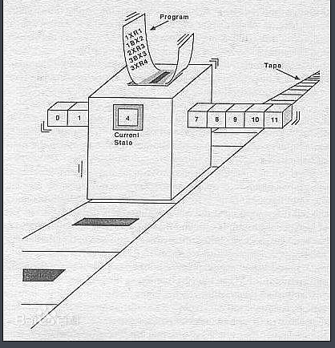
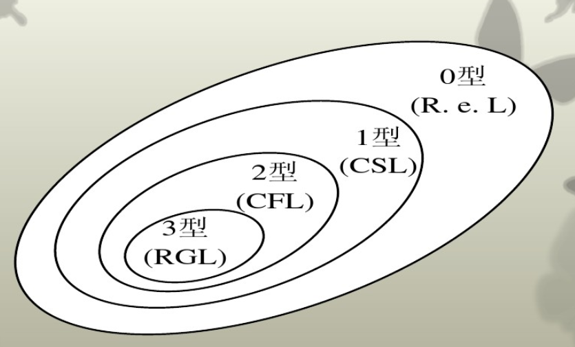
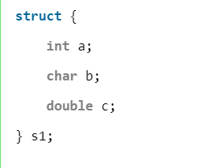
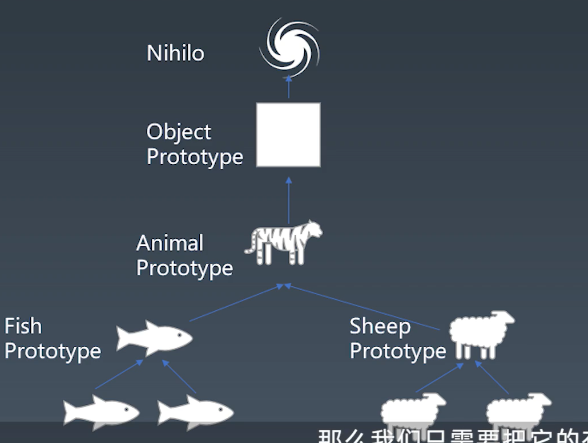
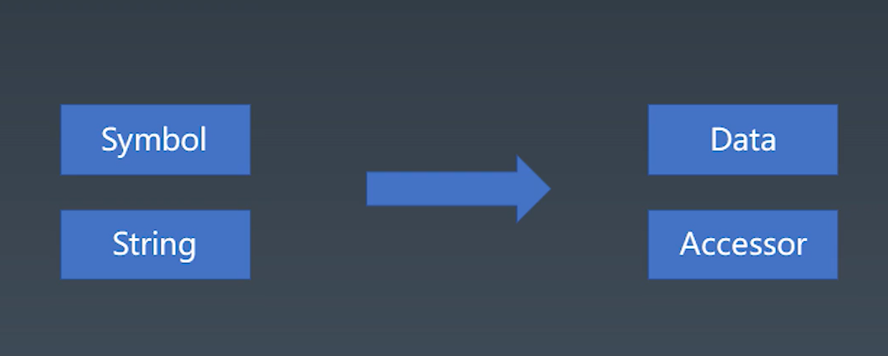

### 上课笔记
---
#### 补充知识：图灵机
所谓的图灵机的基本思想就是用机器模拟人用纸笔模拟数学运算的过程，指一个抽象的机器，它有一条无限长的纸带，纸带分成了一个一个的小方格，每个方格有不同的颜色。有一个机器头在纸带上移来移去。机器头有一组内部状态，还有一些固定的程序。在每个时刻，机器头都要从当前纸带上读入一个方格信息，然后结合自己的内部状态查找程序表，根据程序输出信息到纸带方格上，并转换自己的内部状态，然后进行移动。



#### 补充知识：停机问题
当我们写代码调试的时候, 有时会遇到这样一种情况: 等了很久, 程序还一直在运行. 我们不知道是代码在正常运行只是运行时间比较久, 还是代码写的有问题(比如写了死循环)导致程序根本不会停止. 这时候我们想, 如果能有个工具能为我们判断我们写的代码的运行时间就好了. 这就是停机问题.

但很可惜，**世界上并不存在一行代码让我们能够判定一段函数是否停机**

##### 证明（反证法）
我们假设有一段神之算法`GodSum`能够判定任何一段函数是否停机。
然后我们再假设一段代码是这样的：
```
 void GodSum(program p){...}

 void anotherSum(program p){
   if(GodSum(program p)){
     while(true) // 假如p在GodSum中停机，那么我们让他在这段程序就是死循环
   }else{
     return 
   }
 }
```
这时候，就产生了矛盾了，假如我们将`anotherSum`自身代入`anotherSum`,那会出现：
假如p程序停机，那么第一次进入`antherSum`时会造成死循环，那将第一次进入`anotherSum`代码再放入`antherSum`运算，结果却变成了能够停机，已知对一段代码p来说只会有一个结果，因此我们可以证明是不存在这样一段神之算法判断函数是否停机


#### 泛用语言分类方法
形式语言和非形式语言的区别在于**能否用精确的数学或机器可处理的公式定义的语言**。
按有无严格的规定的语法分类：非形式语言（也称自然语言）、形式语言
形式语言按照乔姆斯基谱系分类：
 + 0型 无限制文法 产生所有能使图灵机停机(在程序中运行时间有限长）的语言 我认为这里算是规则任意自己定
 + 1型 上下文相关文法 对应线性有界自动机（非确定图灵机） 把计算限制在仅仅包含输入的那一段带上的图灵机
 + 2型 上下文无关文法  下推自动机 除了有限状态组成部分外，还包括一个长度不受限制的栈
 + 3型 正则文法 有限状态自动机 拥有有限数量的状态，每个状态可以迁移到零个或多个状态，输入字串决定执行哪个状态的迁移



 下面的文法是属于上文的，即3型会属于0型、1型、2型，但是0型并不属于3型的


 #### 产生式
 这里说的是巴斯克-诺尔范式（BNF），产生式其实有多种类型：EBNF、ABNF、自定义
 + 尖括号括起来的名称表示语法结构名
 + 语法结构又能进一步分类
    + 基础结构--终结符(表示不能再被拆解的符号)
    + 要用其他语法结构定义的复合结构--非终结符  
+ 引号和中间的字符表示终结符（即字符串表示终结符）
+ 可以有括号
+ `*` 表示重复多次
+ `|` 表示或
+ `+`表示至少一次

```javascript
用BNF表示四则运算
例子：1 + 3+ 4 * 2
终结符： NUMBER + * - /
非终结符：MultiplicativeExpression
AddtiveExpression

<MultiplicativeExpression>::= <Number> | <MultiplicativeExpression>"*"<Number> 
  | <MultiplicativeExpression>"/"<Number>
    
<AddtiveExpression>::= <MultiplicativeExpression> | <MultiplicativeExpression>
  "+"<AddtiveExpression> | <MultiplicativeExpression>"-"<AddtiveExpression> 
```

#### 通过BNF理解乔姆斯基谱系
 + 0型 无限制文法 `?::=?`
 + 1型 上下文相关文法 `?<A>?::=?<B>?` 可以写多个非终结符，但是变只能有一个，有前后来判别每一个符号
 + 2型 上下文无关文法  `<A>::=?` 左边只有一个非终结符
 + 3型 正则文法 `<A>::=<A>?` 左右要保持非终结符在最前面 

 Javascript是上下文无关文法，部分来说能够属于正则文法，但是有些特例
 ```javascript
    {
        get a { return 1 }
        get : 1
    }

    2**1**2 //右结合
 ```

 #### 语言的分类
 + 形式语言--用途
    + 数据描述语言
      + JSON
      + HTML
      + XAML
      + SQL
      + CSS
    + 编程语言
      + JS
      + C++
      + Python
      + Lisp
+ 形式语言--表达方式
  + 命令式编程：命令“机器”如何去做事情(how)，这样不管你想要的是什么(what)，它都会按照你的命令实现。
  + 声明式编程：告诉“机器”你想要的是什么(what)，让机器想出如何去做(how)。
  + 声明式语言
     + JSON
      + HTML
      + XAML
      + SQL
      + CSS
      + Lisp
  + 命令型语言
      + JS
      + C++
      + Python

#### 图灵完备性
所有编程语言都需要具备图灵完备性
所有可计算的问题都是可用来描述的,就是具有图灵完备性

+ 命令式语言-图灵机
  + goto
  + if和while
+ 声明式语言-lambda(丘奇)
  + 递归

#### 动态语言与静态语言
+ 动态
  + 用户设备/在线服务器上
  + 产品实际运行时 编写代码不指定变量的数据类型
  + runtime
+ 静态
  + 程序员设备上 编译到用户的机器上是已经没有了类型信息
  + 产品开发时 使用前要声明变量的数据类型
  + compiletime

#### 类型系统
+ 动态类型和静态类型
  + Java是半动态半静态 编译时类型检查，运行时通过反射也能得到数据类型
+ 强类型和弱类型
  + 强类型不允许隐式的类型转换 Java
  + 弱类型则能够发生隐式的转换 c/c++ 
    + string  + number JS 默认string转成number
    + string == boolean JS将boolean先转成Number 在和string对比
+ 复合类型
  + 结构体 (一批数据组合而成的一种新的数据类型。组成结构型数据的每个数据称为结构型数据的“成员”)
  
  + 函数签名(函数或方法的输入与输出,定义函数的第一行)
    + 参数及参数的类型
    + 一个的返回值及其类型
    + 可能会抛出或传回的异常
    + 该方法在面向对象程序中的可用性方面的信息（如public、static 或 prototype）。
+ 子类型（强调的是新类具有父类一样的行为（未必是继承））
+ 泛型 （把类型明确的工作推迟到创建对象或调用方法时才去明确的特殊类型
  + 逆变 （如果某个参数类型可以由其基类替换，那么这个类型就是支持逆变的）
  + 协变（如果某个返回的类型可以由其派生类型替换，那么这个类型就是支持协变的）

#### 基本类型【原子】

语法 + 编译 = 运行时表现 -> 语义

+ 语法
  + literal 字面值
  + variable 变量
  + keywords 关键字
  + whitespace 空格
  + line terminator 换行符

通过我们编译后就变为运行时的一些东西

+ 运行时
  + types 类型 [字面值映射而来]
    + Number
      + IEEE 754  双精度浮点类型
      + 一个符号位 1 是负 0是正
      + 11个指数位
      + 52精度位 
      + 有基准值
      + 0 .toString()
    + String
      + 字符
         + ASCII 127 字符 
        + Unicode 全世界字符
        + UCS 0000-FFFF
        + GB 国标
          + GB2312 与Unicode字符集不兼容，但更省空间
          + GBK
          + GB18030
        + ISO-8859 冲突
        + BIG-5 大五码
      + 码点
      + 编码方式
        + UTF
          + UTF8 一个字节表示一个字符
          + UTF16
    + Boolean
    + Object
    + Null 有值但为空 typeof为object
    + Undefined （非关键字，我们要用void 0来表示真正的undefined值)
    + Symbol
  + execution context 存储得变化 [变量映射]


  #### 对象

  ##### 对象的定义
  + 任何一个对象都是唯一的，与本身的状态无关
  + 状态完全一致的两个对象，也并不相等（三只一摸一样的鱼，其实也是三个对象）
  + 状态描述对象
  + 状态的改变就是行为

  ##### 对象的组成
    + 唯一标识
    + 状态
    + 行为
 
 很多对象有着相似的特征，这时候我们可以采取一定的方式来进行汇总，其中有两种主要的流派：
 + 归类 多继承 c++ 子类能有多个父类
 + 分类 单继承 java js接近 只有一个从属关系 有基类object
 + JS是多范式的语言



nihilo 在js中具体就是null

##### JS中的对象
**带[[属性]]的东西都表示内部属性，无论用那种手段我们都不可访问**
  + property 状态、行为
  + 内在属性 `[[Prototype]]` 
  + key-value对,key 可以是 symbol 和 string，而value 则可以是Data或者是accessor（数据属性/访问器属性）
  + 数据属性一般来说用来描述状态，而访问器属性则用来描述行为
  + 数据属性如果拿来储存函数，也是可以用于描述行为

  

  + data
    + [[value]]
    + writable 为false时仅点运算不可更改
    + enumerable
    + configurable
  + accessor
    + get 
    + set
    + enumerable
    + configurable

##### 如何形成一个对象
   + {} [] . Object.defineProperty 基本的对象机制
   + Object.create Object.setPrototypeOf Object.getPrototypeOf 基于原型描述对象
   + new class extends 基于分类描述对象
   + new function prototype 不伦不类

##### 特殊对象
+ function object
  + 带`[[call]]`方法对象
+ Array：Array 的 length 属性根据最大的下标自动发生变化。
+ Object.prototype：作为所有正常对象的默认原型，不能再给它设置原型了
+ String：为了支持下标运算，String 的正整数属性访问会去字符串里查找
+ Arguments：arguments 的非负整数型下标属性跟对应的变量联动。模块的 namespace 对象：特殊的地方非常多，跟一般对象完全不一样，尽量只用于 import 吧。
+ 类型数组和数组缓冲区：跟内存块相关联，下标运算比较特殊。
+ bind 后的 function：跟原来的函数相关联
+ 宿主对象

##### 补充知识：Symbol
本质上是一种唯一标识符，可用作对象的唯一属性名，这样其他人就不会改写或覆盖你设置的属性值
Symbol 数据类型的特点是**唯一性**，即使是用同一个变量生成的值也不相等。
```javascript
  let id1 = Symbol('id');
  let id2 = Symbol('id');
  console.log(id1 == id2);  //false
 ```

 Symbol 数据类型的另一特点是隐藏性，`for···in`，`object.keys()` 不能访问
 ```javascript
 let id = Symbol("id");
 let obj = {
  [id]:'symbol'
 };
 for(let option in obj){
     console.log(obj[option]); //空
 }
 ```

但是也有能够访问的方法：`Object.getOwnPropertySymbols`
`Object.getOwnPropertySymbols` 方法会返回一个数组，成员是当前对象的所有用作属性名的 Symbol 值。
```javascript
let id = Symbol("id");
 let obj = {
  [id]:'symbol'
 };

let array = Object.getOwnPropertySymbols(obj);
 console.log(array); //[Symbol(id)]
 console.log(obj[array[0]]);  //'symbol'
```

虽然这样保证了Symbol的唯一性，但我们不排除希望能够多次使用同一个symbol值的情况。
为此，官方提供了全局注册并登记的方法：Symbol.for()
```javascript
 let name1 = Symbol.for('name'); //检测到未创建后新建
 let name2 = Symbol.for('name'); //检测到已创建后返回
 console.log(name1 === name2); // true
 ```

通过这种方法就可以通过参数值获取到全局的symbol对象了，反之，能不能通过symbol对象获取到参数值呢？
是可以的 ，通过`Symbol.keyFor()`
```javascript
 let name1 = Symbol.for('name');
 let name2 = Symbol.for('name');
 console.log(Symbol.keyFor(name1));  // 'name'
 console.log(Symbol.keyFor(name2)); // 'name'
```
在创建symbol类型数据时的参数只是作为标识使用，所以 `Symbol()` 也是可以的