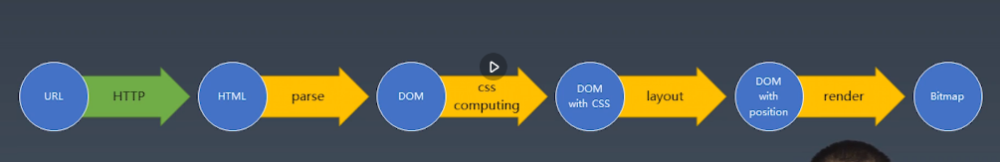
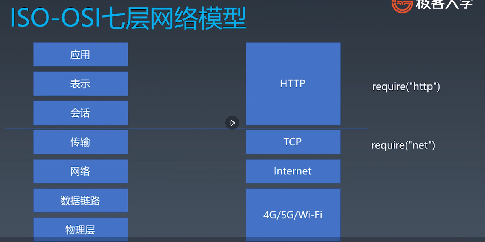

### 浏览器工作原理

#### 浏览器页面渲染步骤


#### 有限状态机处理字符串
+ 每一个状态都是一个机器 互相解耦
    + 在每一个机器里，我们可以做计算，储存，输出
    + 所有的机器接受的输入是一致的
    + 状态机的每一个机器本身没有状态，如果我们用函数来表示的话，他应该是纯函数（无副作用）
+ 每一个机器知道下一个状态
    + 每个机器都有确定的下一个状态 Moore
    + 每个机器根据输入决定下一个状态 Mealy

游戏中敌人的AI其实就是类似于状态机

##### Mealy 
```javascript
    function state(input) // 函数参数就是输入
    {
        // 函数中可以自由地编写代码，处理每个状态的逻辑
        return next; //返回值作为下一个状态
    }

    /* 以下是调用 */
    while(input){
        // 获取输入
        state = state(input) //把状态机的返回值作为下一个状态
    }
```

#### HTTP解析


TCP 三次握手
+ 流
+ 端口
+ require('net')

IP
+ 包
+ IP地址
+ libnet/libpcap c++


#### 如何实现我们的Toy-Browser
###### 实现一个HTTP请求
+ 设计一个HTTP请求的类
+ content type是一个必要的字段，要有默认值
+ body是kv格式
+ 不同的content-type影响body的格式

###### send函数总结
+ 在Request构造器中收集必要的信息
+ 设计一个send函数，把请求真实发送到服务器
+ send函数应该是异步的，所以返回promise 

###### 发送请求
+ 设计支持已有的connection或者自己新建的connection
+ 收到数据传给parser
+ 根据parser状态resolve Promise

###### responseParser
+ Response必须分段构造，我们需要一个ResponseParser来装配
+ ResponseParser分段处理ResponseText,我们使用状态机来分析文本结构

###### BodyParser总结
+ Response的body可能根据Content-Type有不同的结构，因此我们采用子Parser的结构来解决问题
+ 以TrunkedBodyParser为例，我们同样用状态机处理body格式

###### HTML parse模块文件拆分
+ 方便文件管理，将parser单独拆到文件中
+ parser接受HTML文本作为参数，返回一颗dom树

+ 使用FSM来实现HTML的分析
+ 在HTML标准中，已经规定了HTML的状态
+ ToyBrowser中精选版本，完成一个最精简的
[HTML标准](https://html.spec.whatwg.org/multipage/)

###### 解析标签
+ 主要的标签为：开始标签 结束标签 自封闭标签
+ 在现在我们暂时忽略属性

###### 创建元素
+ 状态机中，除了状态迁移，还会加入业务逻辑
+ 我们在标签结束状态提交标签token

###### 处理属性
+ 属性值分为单引号 双引号 无引号三种写法，因此要较多状态处理
+ 处理属性的方式和标签类似
+ 属性结束时，将属性加到标签Token上

###### 解析
+ 从标签构建DOM树的基本技巧是使用栈
+ 遇到开始标签时创建元素并入栈，遇到结束标签时出栈
+ 自封闭节点可视为入栈后立刻出栈
+ 任何元素的父元素是他入栈前的栈顶

+ 文本节点和自封闭标签处理类似
+ 多个文本节点需要合并