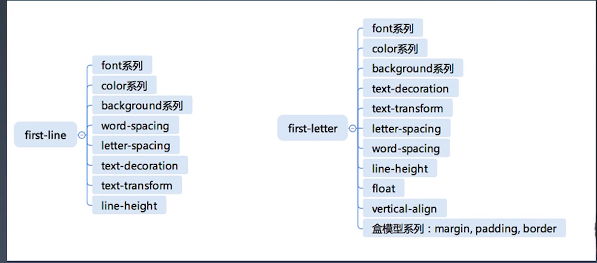

学习笔记

##### CSS并没有现行标准
[CSS2.1标准](https://www.w3.org/TR/CSS21/)

+ CDO、CDC是以前不支持css的文档里做出的适配，他会将能够解析CSS的文档进行解析，而不支持的就会转化成html进行阅读
+ 总体结构
    + @charset
    + @import
    + rules 
        + @media
        + @page
        + rule 普通CSS规则

我们的方向：研究所有的@规则(charset、import、media、page)，在研究其他规则 

##### @-rules
+ @charset
+ @import
+ @media
+ @page 分页媒体特性（通常就是打印机）
+ @counter-style 自定义我们的列表格式
+ @keyframes
+ @fontface
+ @supports 本身具有兼容性，不提倡现在使用
+ @namespace 命名空间，匹配XML还是SVG等。。

##### CSS rules
+ 选择器 
    现行标准 https://www.w3.org/TR/2018/REC-selectors-3-20181106/
    + selector_group
    + selector
        + `>`
        + `<sp>`
        + `+`
        + `~`
    + simple_selector
        + `type`
        + `*`
        + `.`
        + `#`
        + `[]`
        + `:`
        + `::`
        + `:not`
+ 声明(key)
    + properties
    + variables
+ 声明（value)

##### 爬出现行的所有规则
1 在浏览器中输入
Array.prototype.slice.call(document.querySelector("#container").children).filter(e => e.getAttribute("data-tag").match(/css/)).map(e => ({name:e.children[1].innerText, url:e.children[1].children[0].href}))


2 通过JSON格式化
JSON.stringify(Array.prototype.slice.call(document.querySelector("#container").children).filter(e => e.getAttribute("data-tag").match(/css/)).map(e => ({name:e.children[1].innerText, url:e.children[1].children[0].href})))


3 编写我们的代码程序并输入浏览器中得到我们所有的规矩

##### 选择器语法
+ 简单选择器
     + `*`
     + div svg|a 命名空间 html svg MathML
     + .cls class选择器
     + #id id选择器
     + [attr=value] 属性选择器
     + :hover 伪类
     + ::before 伪元素选择器
+ 复杂选择器
    + 复合选择器
        + <简单选择器><简单选择器><简单选择器>
        + *或者div必须写在最前面，伪类伪元素一定在最后面
    + 复杂选择器构成
        + <复合选择器><sp><复合选择器> 子孙选择器
        + <复合选择器>">"<复合选择器> 父子选择器（直接）
        + <复合选择器>"~"<复合选择器> 邻间选择器
        + <复合选择器>"+"<复合选择器> 邻间选择器
        + <复合选择器>"||"<复合选择器> 表格选中列

##### 选择器优先级是怎么算的
我们计算优先级是全部一起加上的[a, b, c, d]
+ 来自于style属性的为a=1
+ ID属性 b = 1 
+ 伪类 属性选择器 c = 1
+ 元素名 微元素 d = 1

+ 特殊规则
    + id在作为属性选择器时 c = 1
    + 逻辑伪类在优先级中均为 0 ，具体有 :not() :is() :where(),他的优先级由括号里面的选择器决定
    + !important是优先级最高

案例
```
    li                                  /* (0, 0, 0, 1) */
    ul li                               /* (0, 0, 0, 2) */
    ul ol+li                            /* (0, 0, 0, 3) */
    ul ol+li                            /* (0, 0, 0, 3) */
    h1 + *[REL=up]                      /* (0, 0, 1, 1) */
    ul ol li.red                        /* (0, 0, 1, 3) */
    li.red.level                        /* (0, 0, 2, 1) */
    a1.a2.a3.a4.a5.a6.a7.a8.a9.a10.a11  /* (0, 0, 11,0) */
    #x34y                               /* (0, 1, 0, 0) */
    li:first-child h2 .title            /* (0, 0, 2, 2) */
    #nav .selected > a:hover            /* (0, 1, 2, 1) */
    html body #nav .selected > a:hover  /* (0, 1, 2, 3) */
```
[参考文档](https://www.zhangxinxu.com/wordpress/2019/07/css-not-pseudo-class/)

##### 伪类
+ 链接/行为
    + :any-link 匹配未访问所有超链接
    + :link :visited 匹配访问过的所有超链接 不支持更改颜色等相关属性，对安全性不友好
    + :hover
    + :active
    + :focus a标签
    + :target
+ 树结构 破坏回溯原则
    + :empty
    + :nth-child
    + :nth-last-child
    + :first-child :last-child :only-child
+ 逻辑性
    + :not
    + :where
    + :has


##### 伪元素
+ ::before
+ ::after
+ ::first-line
+ ::first-letter


##### 为什么 first-letter 可以设置 float 之类的，而 first-line 不行呢？
+ first-line和first-letter最大得不同在于first-line并不会匹配html元素，就是说他本质上他只是在用户流插入该伪元素，无法匹配html，那就无法改变文档流
+ 这就导致了first-line匹配的东西会根据我们用户流得不同而不同
