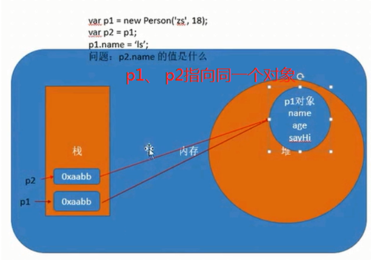
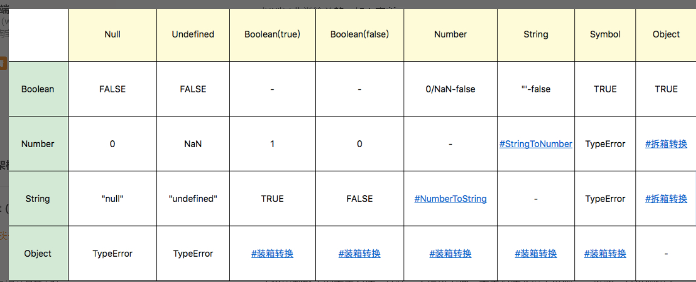
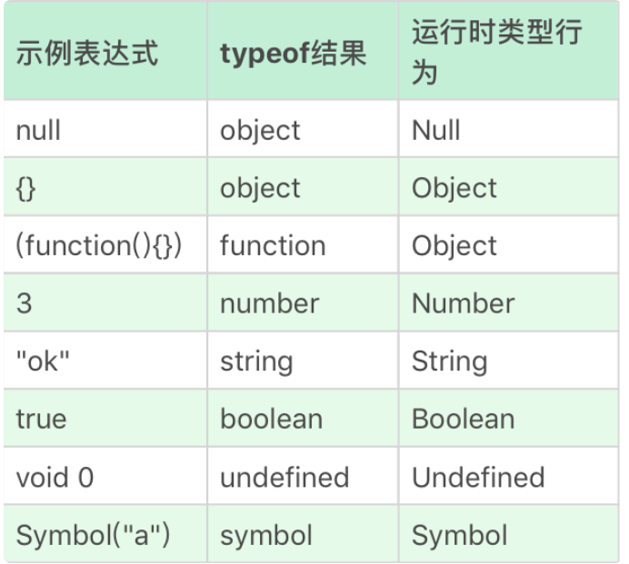

#### 课后复查
+ JS有哪些语言类型
+ 编程时我们为啥要用void 0 代替undefined
+ 数据类型在内存中的储存和引用
+ 字符串是怎么保存的
+ 0.1 + 0.2 不等于 0.3？
+ 为什么说NaN !== NaN
+ 为啥说JS的双等号是废物
+ StringToNumber和 NumberToString真的那么简单吗
+ 如何获得我们真实的类型
+ 拆箱转换是怎么进行
+ 为什么说typeof类型判定不是那么准确
+ 说说双精度浮点数

#### JS模块分为三个阶段，文法阶段（就是我们在编译器中敲代码的阶段）、运行时阶段（编译完成阶段）、执行过程（预解析的过程）

#### JS运行时7种语言类型
+ Undefined
+ Null (关键字)
+ Boolean
+ String
+ Number
+ Symbol
+ Object

##### 为啥要用void 0代替undefined？
+ undefined 是个变量，非关键字
+ void 0 会返回一个undefined值， 但其实void 任何东西都会是undefined值，but 约定俗成，大家都用undefined
+ undefined是个类型，其底下的值也是undefined
+ 我们在函数内部定义undefined时还能够重新赋值

##### 数据类型在内存中的储存和引用
+ 数据类型有简单数据类型以及复杂数据类型
+ 除了Object以外其他都是简单数据类型
+ 简单数据类型的方法其实是JS进行了装箱后变成Object后调用的，它本身并没有方法，因此在JS中每个基本类型都在Object中有个相对应的Object类型
+ 除了Object 是在堆中储存的以外，其他数据类型都是在栈中储存

+ 值得注意的是Symbol不能直接new对象，但是却还是个构造器

##### 字符串是怎么保存的
+ 字符串的最大长度2^53 - 1
+ 通过映射进行字符集的搜索，本质还是某个数字代码代表某个字形，现在最常用的是Unicode字符集，字符编码方式是UTF-16

###### 0.1 + 0.2 不等于 0.3？而0.1 + 0.1 = 0.2却相等了
+ 小数在计算机里是用2的平方来表示的，因此它必然不能准确表达我们的小数
+ 不是所有的数都不会计算出相等，因为JS已经在规范中设定了近似范围，但有些数的计算超出了近似范围，这里发生了精度丢失，于是就返回了false
+ Math.abs(0.1 + 0.2 - 0.3) <= Number.EPSILON ，正确是检测绝对值是否小于最小精度

##### 为什么说NaN !== NaN
NaN和+Infinity的规定实际是IEEE 754标准规定的特殊值：
（e为指数的位数，双精度中e=11）
- 指数为2^e – 1且尾数的小数部分全0，这个数字是±∞。（符号位决定正负）
- 指数为2^e – 1且尾数的小数部分非全0，这个数字是NaN，比如单精度浮点数中按位表示：S111 1111 1AXX XXXX XXXX XXXX XXXX XXXX，S为符号位值无所谓，A是小数位的最高位（整数位1省略），其取值表示了NaN的类型：X不能全为0，并被称为NaN的payload

2. NaN，占用了 9007199254740990，这个叙述不对
NaN中 9007199254740990 被占用是什么意思的疑问，实际是第一点描述的关于NaN规定和参考双精度浮点数的表达方式，尾数共有53位，
+ 指数固定为2^e – 1并去掉±∞两个值，那么NaN其实是 2^53-2 个特殊数字的合集（2^53-2 = 9007199254740990 ）
并不是 9007199254740990 被占用，而是 9007199254740990 个特殊值被占用来表示 NaN

扩展一下，我们就可以理解为什么NaN !== NaN了，它确实不是一个值，而是一群值呢！

##### 为啥说JS的双等号是废物
+ 因为JS的双等号会把我们的类型值莫名其妙的转换了，比如 Boolean的true和Number 的1 在双等号时会相等，因此我们可以直接的说，丢掉双等号这个垃圾
+ 有兴趣可以看下这个垃圾

##### StringToNumber和 NumberToString真的那么简单吗
+ StringToNumber最主要的问题是我们parseInt这个函数遇到非数字会直接返回反数字前的数字，而不会返回NaN
+ NumberToString最主要的问题就是Number数字较大时会变成由科学计数法来表示

##### 如何获得我们真实的类型
+ 直接使用Object函数，能够显式调用装箱能力
+ 每一类装箱的对象都有私用的[[Class]]属性，JS中只赋予了Object.prototype.toString()来识别这底层的类型，这会比instanceof来的准确
+ 我们想获得某对象的值，还需要调用call函数，改变函数指向，因此获得私有的[[class]]值应该是`Object.prototype.toString.call()`
+ 但因为call也会产生装箱操作，所有有时候还要配合typeof来进行区分基本类型和对象类型

#####  拆箱转换是怎么进行
+ 通过ToPrimitive函数进行转换，他的步骤
    + 是否传了preferredType（Object本身有没有进行类型转换)，没有传则默认number
    + 假如传入String值，就调用”toString、valueOf"
    + 否则会按顺序后调用"valueOf、toString"
+ 我们可以通过@@toPrimitive进行重写

##### 为什么说typeof类型判定不是那么准确
+ 运行时和规定有不一样的地方，如null的typeof结果是object

##### 散装知识点
+ Number 有 2^64 - 2^53 + 3 个值
+ 符合IEEE 754-2008规定的双精度浮点数规则
+ 几个例外数字场景
    + NaN 
    + Infinity
    + -Infinity
+ JS中是有 +0 和 -0 的区别的

##### 了解：语言实现时的规范类型
+ List 描述参数列表的执行
+ Record 描述算法中的数据聚合
+ set 解释内存模型中无序元素集合
+ relation 解释与set之间的关系
+ completion record 解释运行时完成时的记录
+ reference 解析delete typeof等运算符的使用
+ property descriptor 属性描述符，解释对象属性的特性操作
+ lexical environment / environment record 描述作用域
+ data blocks 描述二进制数据

##### 说说双精度浮点数
+ JS中所有的number都是以双浮点数进行储存的
+ 双精度浮点数的构造是：1个符号位 + 11个指数位 + 52个精度位 = 64位
+ 符号位 1 表示负数，0表示正数
+ 指数位有个基准值1023，因此我们表示0的时候指数位应该是 0 1111111111
+ 变成双精度浮点数： 十进制转成二进制 、进行科学计数法、拆分出符号位、指数位、精度位
