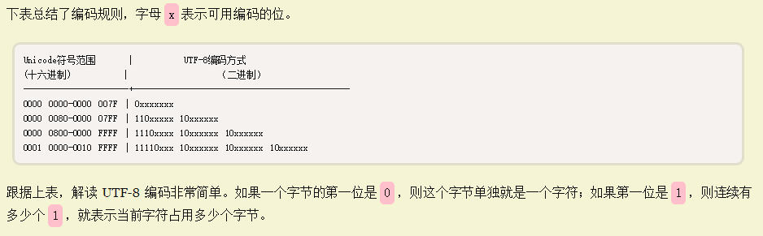
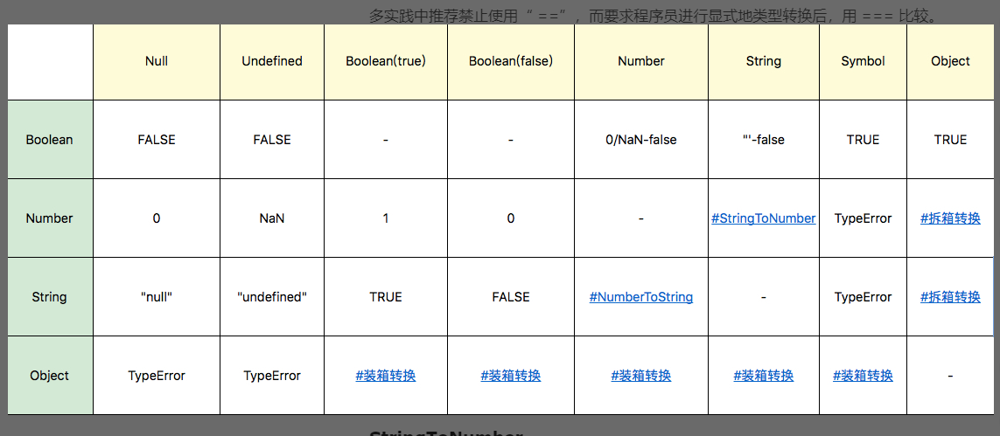
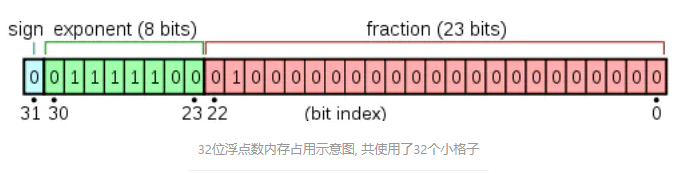
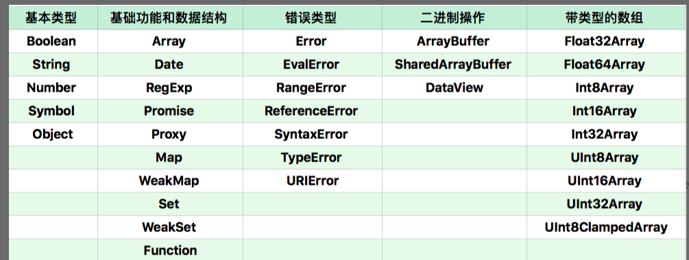

### 预习笔记
---
#### 注意
**语法 + 编译 = 运行时 表现的语义**
**带`[[属性]]`的属性都表示JS引擎的内部属性，我们用任何方式都不能得到这个值**

#### JavaScript 的类型，你忽视了啥
##### 补充知识：Unicode、UTF8、UTF16
###### 抽象字符
抽象字符 = 有形字符(a、b、天) + 在计算机中表示空白的纯抽象字符（null、\x00)

###### 抽象字符集（ACR）
+ 抽象字符的集合
+ 无序性
+ 如 ASCII、UCS、GBK都属于抽象字符集

###### 编码字符集(CCS)
为了更好的描述，操作字符，我们可以为抽象字符集中的每个字符关联一个数字编号，这个数字编号称之为**码位/码点**(Code Point)
+ 字符与码位产生了映射的关系
+ 编码字符集完全可以依据个人爱好来搞，如ASCII和UCS，但因为我们需要有一个同一的规范，因此产生了统一字符集（UCS)

###### 统一字符集（UCS = Unicode)
Unicode 只是一个符号集，它只规定了**符号的二进制代码**，却没有规定这个二进制代码应该如何存储，本质来说UCS是无限的

这里就有两个严重的问题，第一个问题是，如何才能区别 Unicode 和 ASCII ？计算机怎么知道三个字节表示一个符号，而不是分别表示三个符号呢？第二个问题是，我们已经知道，英文字母只用一个字节表示就够了，如果 Unicode 统一规定，每个符号用三个或四个字节表示，那么每个英文字母前都必然有二到三个字节是0，这对于存储来说是极大的浪费，文本文件的大小会因此大出二三倍，这是无法接受的。

它们造成的结果是：1）出现了 Unicode 的多种存储方式，也就是说有许多种不同的二进制格式，可以用来表示 Unicode。2）Unicode 在很长一段时间内无法推广，直到互联网的出现。

###### UTF-8
互联网的普及，强烈要求出现一种统一的编码方式。UTF-8 就是在互联网上使用最广的一种 Unicode 的实现方式。其他实现方式还包括 UTF-16（字符用两个字节或四个字节表示）和 UTF-32（字符用四个字节表示），不过在互联网上基本不用。重复一遍，这里的关系是，UTF-8 是 Unicode 的实现方式之一。

+ 变长的编码方式。它可以使用1~4个字节表示一个符号，根据不同的符号而变化字节长度
+ 对于单字节的符号，字节的第一位设为0，后面7位为这个符号的 Unicode 码。因此对于英语字母，`UTF-8 `编码和 `ASCII `码是相同的
+ 对于n字节的符号`（n > 1）`，第一个字节的前n位都设为`1`，第`n + 1`位设为0，后面字节的前两位一律设为10。剩下的没有提及的二进制位，全部为这个符号的 Unicode 码

下面，还是以汉字严为例，演示如何实现 UTF-8 编码。

`严`的 Unicode 是`4E25`（`100111000100101`），根据上表，可以发现`4E25`处在第三行的范围内（`0000 0800 - 0000 FFFF`），因此严的 UTF-8 编码需要三个字节，即格式是`1110xxxx 10xxxxxx 10xxxxxx`。然后，从严的最后一个二进制位开始，依次从后向前填入格式中的x，多出的位补0。这样就得到了，严的 UTF-8 编码是`11100100 10111000 10100101`，转换成十六进制就是`E4B8A5`。

###### 字符编码表（CEF）
在ASCII这样传统的、简单的字符编码系统中，并没有也不需要区分字符编号与字符编码，可认为字符编号就是字符编码，字符编号与字符编码之间是一个直接映射的关系。

而在Unicode这样现代的、复杂的字符编码系统中，则必须区分字符编号与字符编码，字符编号不一定等于字符编码，字符编号与字符编码之间不一定是一个直接映射的关系，比如UTF-8、UTF-16为`间接映射`，而UTF-32则为`直接映射`。

UTF-8、UTF-16与UTF-32等就是Unicode字符集(即编号字符集)`常用的字符编码方式CEF`。（UTF-8、UTF-16与UTF-32后文各有详细介绍）

将编码字符集的非负整数值（即抽象的码位）转换成有限比特长度的整型值（称为**码元**code units）的序列

虽然就目前来看，UCS收录的符号总共也就十多万个，用一个uint可以表示几十亿个字符呢。但谁知道哪天制定Unicode标准的同志们不会玩心大发造几十亿个Emoji加入UCS中。所以说到底，一对有限与无限的矛盾，必须通过一种方式进行调和。这个解决方案，就是字符编码表(Character Encoding Form)。

字符编码方式CEF，是将编号字符集里字符的码点值(即码点编号、字符编号)转换成或者说编码成有限比特长度的编码值(即字符编码)。该编码值实际上是码元(Code Unit代码单元、编码单元)的序列(Code Unit Sequence)。


参考链接：
[字符编码掠影：现代编码模型](https://developer.aliyun.com/article/63036)
[字符编码笔记：ASCII，Unicode 和 UTF-8](http://www.ruanyifeng.com/blog/2007/10/ascii_unicode_and_utf-8.html)

##### 运行时类型有哪些
+ undefined
+ null
+ boolean
+ string
  + 最大长度2^53 - 1
  + 它的最大长度表示的是编码长度
  + 并不是每个码元都会对应着一个码点
+ number
  + 有 2^64 - 2^53+3 个值
  + IEEE 754-2008 规定的双精度浮点数规则
  + 例外： NaN、Infinity、-Infinity
  + +0 和 -0 并不一致
  + 后面的浮点可能是系统自动为我们补充的
+ symbol 生成对象中唯一标识的key
+ object
  + 几个基本类型在对象中都是有"亲戚"
    + Number
    + String
    + Boolean
    + Symbol
  + 3 和 new Number(3) 是完全不同的值
  + Symbol 函数比较特殊，直接用 new 调用它会抛出错误，但它仍然是 Symbol 对象的构造器

##### 类型转换



###### 补充知识：IEEE 754-2008 规定的浮点数规则
+ 分为 单精度浮点型 和 双精度浮点型
+ 约定俗成的认为 float = 单精度浮点型 , double = 双精度浮点型


32位浮点数分成：
+ sign 符号位 0是正数 1是负数
+ biased exponent 偏移后的指数位
+ fraction 尾数位

参考资料:
[浮点数的二进制表示](https://www.ruanyifeng.com/blog/2010/06/ieee_floating-point_representation.html)
[IEEE754标准: 一 , 浮点数在内存中的存储方式](https://www.jianshu.com/p/8ee02e9bb57d)

##### 为什么要用void 0代替undefined
`undefined`、`NaN`和`Infinity`都是全局对象window的属性,他只是将这个属性的`[[writable]]`改为了`false`而`null`则是JS的保留字
```javascript
  var undefined = 10;
  console.log(undefined) // undefined
  console.log(Object.getOwnPropertyDescriptor(window, "undefined"))
  // {value: undefined, writable: false, enumerable: false, configurable: false}

  var null = 11
  console.log(null) 
  // Uncaught SyntaxError: Unexpected token 'null'
```
用`void 0`代替`undefined`的目的很简单，保证我们的赋值是纯正的undefined值，因为undefined作为一个变量完全有可能被污染

#### 如何比较我们小数
```javascript
console.log( 0.1 + 0.2 == 0.3); // false
```
这个奇怪的现象我想是一个成功的前端都会碰过壁的东西，那为什么会这样呢？原因在于浮点数并不能准确的表示0.1，0.2，0.3这样的数组，因此我们在编码或者解释的时候，其实0.1已经舍入为与0.1最接近的数字
**正确的比较**
```javascript
console.log( Math.abs(0.1 + 0.2 - 0.3) <= Number.EPSILON); // true
```

##### 补充知识：Symbol
本质上是一种唯一标识符，可用作对象的唯一属性名，这样其他人就不会改写或覆盖你设置的属性值
Symbol 数据类型的特点是**唯一性**，即使是用同一个变量生成的值也不相等。
```javascript
  let id1 = Symbol('id');
  let id2 = Symbol('id');
  console.log(id1 == id2);  //false
 ```

 Symbol 数据类型的另一特点是隐藏性，`for···in`，`object.keys()` 不能访问
 ```javascript
 let id = Symbol("id");
 let obj = {
  [id]:'symbol'
 };
 for(let option in obj){
     console.log(obj[option]); //空
 }
 ```

但是也有能够访问的方法：`Object.getOwnPropertySymbols`
`Object.getOwnPropertySymbols` 方法会返回一个数组，成员是当前对象的所有用作属性名的 Symbol 值。
```javascript
let id = Symbol("id");
 let obj = {
  [id]:'symbol'
 };

let array = Object.getOwnPropertySymbols(obj);
 console.log(array); //[Symbol(id)]
 console.log(obj[array[0]]);  //'symbol'
```

虽然这样保证了Symbol的唯一性，但我们不排除希望能够多次使用同一个symbol值的情况。
为此，官方提供了全局注册并登记的方法：Symbol.for()
```javascript
 let name1 = Symbol.for('name'); //检测到未创建后新建
 let name2 = Symbol.for('name'); //检测到已创建后返回
 console.log(name1 === name2); // true
 ```

通过这种方法就可以通过参数值获取到全局的symbol对象了，反之，能不能通过symbol对象获取到参数值呢？
是可以的 ，通过`Symbol.keyFor()`
```javascript
 let name1 = Symbol.for('name');
 let name2 = Symbol.for('name');
 console.log(Symbol.keyFor(name1));  // 'name'
 console.log(Symbol.keyFor(name2)); // 'name'
```
在创建symbol类型数据时的参数只是作为标识使用，所以 `Symbol()` 也是可以的

我们可以使用 Symbol.iterator 来自定义 for…of 在对象上的行为：
```javascript
 var o = new Object 
 o[Symbol.iterator] = function() { 
   var v = 0 
    return { 
      next: function() { 
        return { value: v++, done: v > 10 } 
        }
      } 
    }; 
    
    for(var v of o) 
      console.log(v); // 0 1 2 3 ... 9
 ```

#### 拆箱与装箱
类型转换能否构成装箱或者拆箱，前提是：这两个类型是否存在继承的关系
每当读取一个基本类型的时候，后台就会创建一个对应的基本包装类型对象，从而让我们能够调用一些方法来操作这些数据。
```javascript
var s1 = "abc";
var s2 = s1.indexOf("a")
```
变量s1是一个基本类型值，它不是对象，它不应该有方法。但是js内部为我们完成了一系列处理（即装箱），使得它能够调用方法,实现的机制如下：
（1）创建String类型的一个实例；
（2）在实例上调用指定的方法；
（3）销毁这个实例；
下面来看看代码实现：
```javascript
  var s1  = new String("some text");
  var s2 = s1.substring(2);
  s1 = null;
```
这样就完成装箱，我们也就能在s1上调用方法了

拆箱：将引用类型对象转换为对应的值类型对象

它是通过引用类型的`valueOf()`或者`toString()`方法来实现的。如果 valueOf 和 toString 都不存在，或者没有返回基本类型，则会产生类型错误 TypeError。如果是自定义的对象，你也可以自定义它的`valueOf()/tostring()`方法，实现对这个对象的拆箱。
```javascript
 var objNum = new Number(123);  
 var objStr =new String("123");   
 console.log( typeof objNum ); //object
 console.log( typeof objStr ); //object 
 console.log( typeof objNum.valueOf() ); //number
 console.log( typeof objStr.valueOf() ); //string

 console.log( typeof objNum.toString() ); // string 
 console.log( typeof objStr.toString() ); // string
```


#### JS究竟面向对象还是基于对象
##### 什么是对象
从人类认知来说： 
  + 一个可以触摸或者可以看见的东西；
  + 人的智力可以理解的东西；
  + 可以指导思考或行动（进行想象或施加动作）的东西

从编程语言来说：
  + 对象具有唯一标识性：即使完全相同的两个对象，也并非同一个对象
  + 对象有状态：对象具有状态，同一对象可能处于不同状态之下。
  + 对象具有行为：即对象的状态，可能因为它的行为产生变迁。

一般的编程语言：类描述对象，JS语言：原型，这种的不一样使得对象具有高度的动态性，这是因为 JavaScript 赋予了使用者在运行时为对象添改状态和行为的能力。

##### JS的两类属性
+ 数据属性
  + value：就是属性的值
  + writable：决定属性能否被赋值
  + enumerable：决定 for in 能否枚举该属性
  + configurable：决定该属性能否被删除或者改变特征值
+ 访问器属性
  + getter：函数或 undefined，在取属性值时被调用
  + setter：函数或 undefined，在设置属性值时被调用
  + enumerable：决定 for in 能否枚举该属性
  + configurable：决定该属性能否被删除或者改变特征值

##### 属性的获取及定义
对象本质就是一个属性的索引结构，比如O对象来说，a就是key，然后{ value: 2, writable: false, enumerable: false, configurable: true }这些对象值就是value
```javascript
  // 定义对象属性
   var o = { a: 1 }
   console.log(Object.getOwnPropertyDescriptor(o, "a"))
   Object.defineProperty(o, "b", { value: 2, writable: false, enumerable: false, configurable: true })
   console.log(Object.getOwnPropertyDescriptor(o, "b"))

    var o = {
        val: null,
        get c() { return this.val },
        set c(val) { this.val = val + 1 }
      };
   o.c = 3
   console.log(o.c); // 1
   console.log(Object.getOwnPropertyDescriptor(o, "c"))
```
Javscript是一个面向对象的语言，但是由于他是以原型的方式来构造对象，使得他能够与其他编程语言不一样的对对象有着高度的动态性

#### 我们真的需要类嘛
JS得原型系统
+ 如果所有对象都有私有字段`[[prototype]]`，就是对象的原型
+ 读一个属性，如果对象本身没有，则会继续访问对象的原型，直到原型为空或者找到为止

操纵原型得方法
+ Object.create 根据指定的原型创建新对象，原型可以是 null
+ Object.getPrototypeOf 获得一个对象的原型
+ Object.setPrototypeOf 设置一个对象的原型

模拟生成类
```javascript
  function Cat() {

　　　　this.name = "大毛";

　　}
  var cat1 = new Cat();

　alert(cat1.name); // 大毛

  function c2(){}
  c2.prototype.p1 = 1;
  c2.prototype.p2 = function(){ console.log(this.p1);}
  var o2 = new c2;
  o2.p2();
```

用原型抽象并继承得例子
```javascript
  var cat = { 
    say(){ 
      console.log("meow~"); 
      }, 
    jump(){ 
      console.log("jump"); 
    }}
    
    var tiger = Object.create(cat, { 
      say:{ 
        writable:true, 
        configurable:true, 
        enumerable:true, 
        value:function(){ 
          console.log("roar!"); 
          } 
        }
      })
          
    var anotherCat = Object.create(cat);
    anotherCat.say();
    var anotherTiger = Object.create(tiger);
    anotherTiger.say();
```
+ __proto__和constructor属性是对象所独有的

+ prototype属性是函数所独有的。但是由于JS中函数也是一种对象，所以函数也拥有__proto__和constructor属性

+ 每个实例对象（ object ）都有一个私有属性（称之为` __proto__ `）指向它的构造函数的原型对象（prototype ）

#### Javascript 对象分类
+ 宿主对象 JS宿主环境提供 window属性由标准及浏览器共同形成
+ 内置对象 JS提供对象
  + 固有对象 由标准制定，JS运行时创建 
  + 原生对象  使用内部构造器/特殊语法创建
  + 普通对象  {}、Object构造器、class关键字定义，**能被原型继承**

> 固有对象和原生对象多数有私有字段，使得原型继承失效

内置对象一览表


#### 函数对象&构造器对象
+ 具有`[[call]]`私有字段的对象，构造器对象的定义是：具有私有字段`[[construct]]`的对象
+ `[[construct]]`的执行过程如下：以 `Object.prototype` 为原型创建一个新对象；以新对象为 this，执行函数的`[[call]]`；如果`[[call]]`的返回值是对象，那么，返回这个对象，否则返回第一步创建的新对象。

这样的规则造成了个有趣的现象，如果我们的构造器返回了一个新的对象，那么 new 创建的新对象就变成了一个构造函数之外完全无法访问的对象，这一定程度上可以实现“私有”。
```javascript
function cls(){ 
  this.a = 100; 
  return { getValue:() => this.a }
  }
  var o = new cls;
  o.getValue(); //100
  //a在外面永远无法访问到
```

#### 特殊行为的对象
除了上面介绍的对象之外，在固有对象和原生对象中，有一些对象的行为跟正常对象有很大区别。它们常见的下标运算（就是使用中括号或者点来做属性访问）或者设置原型跟普通对象不同，这里我简单总结一下。
+ Array：Array 的 length 属性根据最大的下标自动发生变化。
+ Object.prototype：作为所有正常对象的默认原型，不能再给它设置原型了
+ String：为了支持下标运算，String 的正整数属性访问会去字符串里查找
+ Arguments：arguments 的非负整数型下标属性跟对应的变量联动。模块的 namespace 对象：特殊的地方非常多，跟一般对象完全不一样，尽量只用于 import 吧。
+ 类型数组和数组缓冲区：跟内存块相关联，下标运算比较特殊。
+ bind 后的 function：跟原来的函数相关联。

#### Promise得代码比setTimeout先执行？
js引擎会常驻内存中，等待我们把js代码或者函数传递给它执行
+ 宏观任务 宿主发起的任务
  + setTimeout
  + setInterval
  + setImmediate
  + requestAnimationFrame
  + I/O
  + UI rendering
+ 微观任务 JS引擎发起的任务
  + process.nextTick
  + Promise
  + Object.observe
  + MutationObserver
  + async/await

**宏观任务是按顺序一个个执行的，而每个宏观任务中的微观任务也是按照顺序一个个执行**

#### Promise 怎么用
```javascript
  function sleep(duration) {
     return new Promise(function(resolve, reject) { 
       setTimeout(resolve,duration); 
       }) 
    } 
      
    sleep(1000).then( ()=> console.log("finished"));
```

#### 闭包
古典的闭包定义
+ 环境部分
  + 环境
  + 标识符列表
+ 表达式部分

JS标准中的闭包
+ 环境部分
  + 环境：函数的词法环境（执行上下文的一部分）
  + 标识符列表：函数中用到的未声明的变量
+ 表达式部分：函数体

因此JS的函数就是闭包

#### 执行上下文
+ ES3
  + scope 作用域
  + variable object 变量对象
  + this value this值
+ ES5
  + lexical environment：词法环境，当获取变量时使用
  + variable environment：变量环境，当声明变量时使用
  + this value：this 值
+ ES2018
  + lexical environment：词法环境，当获取变量或者 this 值时使用。
  + variable environment：变量环境，当声明变量时使用。
  + code evaluation state：用于恢复代码执行位置。
  + Function：执行的任务是函数时使用，表示正在被执行的函数。
  + ScriptOrModule：执行的任务是脚本或者模块时使用，表示正在被执行的代码。
  + Realm：使用的基础库和内置对象实例。
  + Generator：仅生成器上下文有这个属性，表示当前生成器。